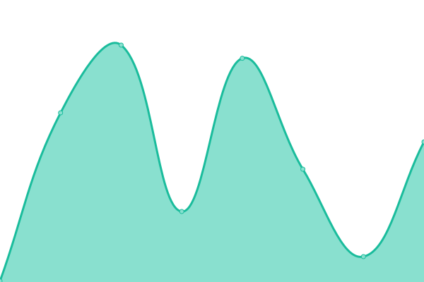

<!--start: status pages-->
<!-- This summary is generated by Upptime (https://github.com/upptime/upptime) -->
<!-- Do not edit this manually, your changes will be overwritten -->
<!-- prettier-ignore -->
| URL | Status | History | Response Time | Uptime |
| --- | ------ | ------- | ------------- | ------ |
|  [By.com.vn](https://by.com.vn) | 🟩 Up | [by-com-vn.yml](https://github.com/chungvku/bycom.vn/commits/HEAD/history/by-com-vn.yml) | 

 676ms
     
 | 

<a href="https://status.by.com.vn/history/by-com-vn">100.00%</a>
    

|  [Wikipedia](https://en.wikipedia.org) | 🟩 Up | [wikipedia.yml](https://github.com/chungvku/bycom.vn/commits/HEAD/history/wikipedia.yml) | 

 272ms
     
 | 

<a href="https://status.by.com.vn/history/wikipedia">100.00%</a>
    

<!--end: status pages-->

[**Visit our status website →**](https://status.by.com.vn)
